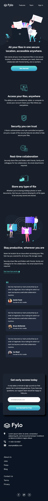
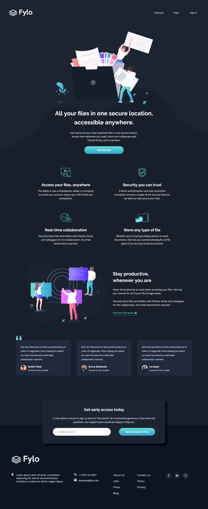

# Frontend Mentor - Fylo dark theme landing page solution

This is a solution to the [Fylo dark theme landing page challenge on Frontend Mentor](https://www.frontendmentor.io/challenges/fylo-dark-theme-landing-page-5ca5f2d21e82137ec91a50fd). Frontend Mentor challenges help you improve your coding skills by building realistic projects. 

## Table of contents

- [Overview](#overview)
  - [The challenge](#the-challenge)
  - [Screenshot](#screenshot)
  - [Links](#links)
- [My process](#my-process)
  - [Built with](#built-with)
  - [What I learned](#what-i-learned)
  - [Continued development](#continued-development)
  - [Useful resources](#useful-resources)
- [Author](#author)

## Overview

### The challenge

Users should be able to:

- View the optimal layout for the site depending on their device's screen size
- See hover states for all interactive elements on the page

### Screenshot
<table>
    <tr>
        <td>
            
        </td>
    </tr>
    <tr>
        <td>
            
        </td>
    </tr>
</table>

### Links

- Solution URL: [here](https://your-solution-url.com)
- Live Site URL: [here](https://zun-liang.github.io/fylo-landing-page/)

## My process

### Built with

- Semantic HTML5 markup
- CSS custom properties
- Flexbox
- CSS Grid
- Mobile-first workflow
- [React](https://reactjs.org/) - JS library
- [Styled Components](https://styled-components.com/) - For styles
- Vite

### What I learned

- how to work with svg in styled-components
- styled-components transient-props
- how to style multiple backgrounds for the same element
- how to style FontAwesome in React and styled-components

### Continued development

- React router
- React context
- React custom hooks
- render props
- unit testing
- styled-components

### Useful resources

- [How to Import SVGs in a React and Vite app](https://www.freecodecamp.org/news/how-to-import-svgs-in-react-and-vite/) 
- [Handling Custom SVGs in React using Styled Components](https://vaadarsh8178.medium.com/handling-custom-svgs-in-react-using-styled-components-30d2739ff4cb)

## Author

- Website - [Zun Liang](https://zun-liang.github.io/)
- Frontend Mentor - [@zun-liang](https://www.frontendmentor.io/profile/zun-liang)